# KOReader Userpatches

This repository contains userpatches for customizing KOReader and its plugins.

The patches currently target:
- [Project: Title](https://github.com/joshuacant/ProjectTitle) plugin

**Note:** The weather lockscreen patch has been converted to a standalone plugin: [loeffner/WeatherLockscreen](https://github.com/loeffner/WeatherLockscreen)

## Installation

See the [KOReader documentation](https://koreader.rocks/user_guide/#L2-userpatches) for more information.

1. **Create a directory named patches under koreader directory on your device**

2. **Download and put the patch file with .lua extension in this patches directory**
   - You may want to modify the patch for your use-case.

3. **Restart KOReader:**
   - You can see the list and status of your user patches and enable/disable them in `Patch Management`.

## Weather Lockscreen Plugin

**The Weather Lockscreen patch has been converted to a standalone plugin and moved to its own repository:**

### **[loeffner/WeatherLockscreen](https://github.com/loeffner/WeatherLockscreen)** 🌤️

This is now a full-featured KOReader plugin that displays beautiful weather information on your sleep screen, with multiple display formats and easy configuration - no need to edit source code!

## [Weather Lockscreen patches](weather-lockscreen)

### [🞂 2-weather-today-tomorrow-view-hours.lua](weather-lockscreen/2-weather-today-tomorrow-view-hours.lua)
Requires WeatherLockscreen v0.9.2-beta.1

The Patch allows you to modify the hours that are shown in the "Today & Tomorrow" display and the "Today" display.

See Screenshots 

| Before | After |
|--------|-------|
|  |  |

2-weather-today-tomorrow-view-hours 
**Before:** The shown hours are 6am, 12pm, 6pm. **After:** User defined hour are shown.

## [Project: Title Patches](project-title)

### [🞂 2-pt-modify-font-sizes.lua](project-title/2-pt-modify-font-sizes.lua)
Requires Project:Title v3.5

Customize font sizes for titles, authors, and metadata in list view. \
I use this patch to disable the auto-sizing and make the strings look more uniform
by setting maximum and minimum font sizes to the same value.

See Screenshots 

| Before | After |
|--------|-------|
| <a href="resources/fontsize_vanilla_grid.png">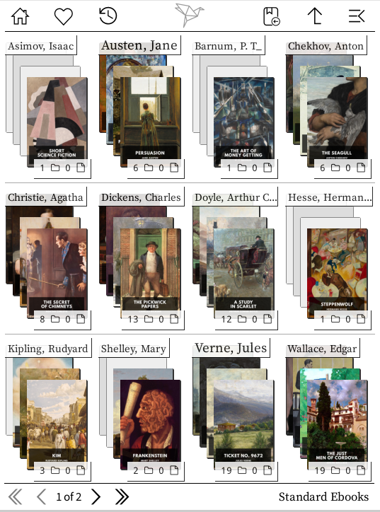</a> | <a href="resources/fontsize_patched_grid.png">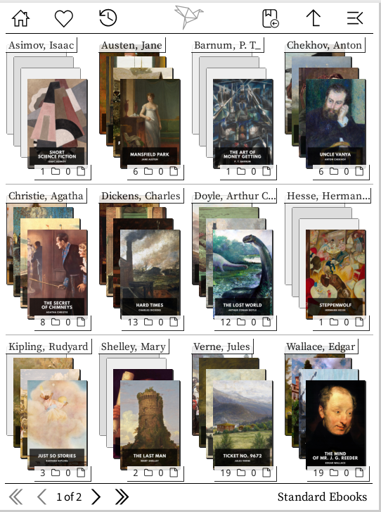</a> |
|  |  |

2-pt-modify-font-sizes 
**Before:** The directory strings are of varying font sizes. **After:** The directory strings are uniform. The limits for maximum/minimum font size are customizable.

### [🞂 2-pt-disable-progress-string.lua](project-title/2-pt-disable-progress-string.lua)
Removes the reading status text (New/Reading/Finished/On hold) from list view.
Attention: If you are using a different localization than english (or german), you will have to adapt the patch and add the strings in your language.

See Screenshots 

| Before | After |
|--------|-------|
| <a href="resources/progress_string_vanilla.png">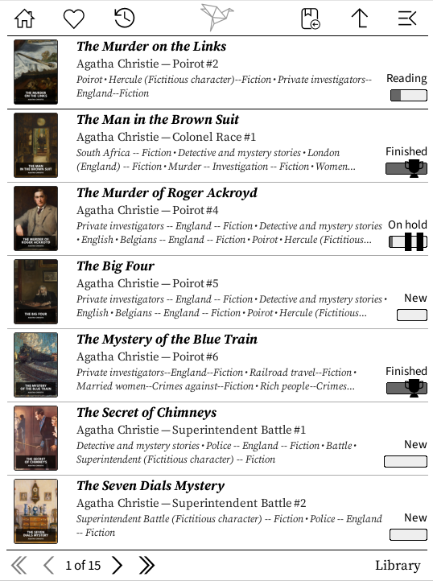</a> |  |

2-pt-disable-progress-string 
**Before:** There is a string above the progress bar indicating the reading status. **After:** Removed.

### [🞂 2-pt-limit-tags.lua](project-title/2-pt-limit-tags.lua)
Requires Project:Title v3.5

See Screenshots 

Limit the number of tags displayed under books in list view.
| Before | After |
|--------|-------|
|  | <a href="resources/tags_limit_patched.png">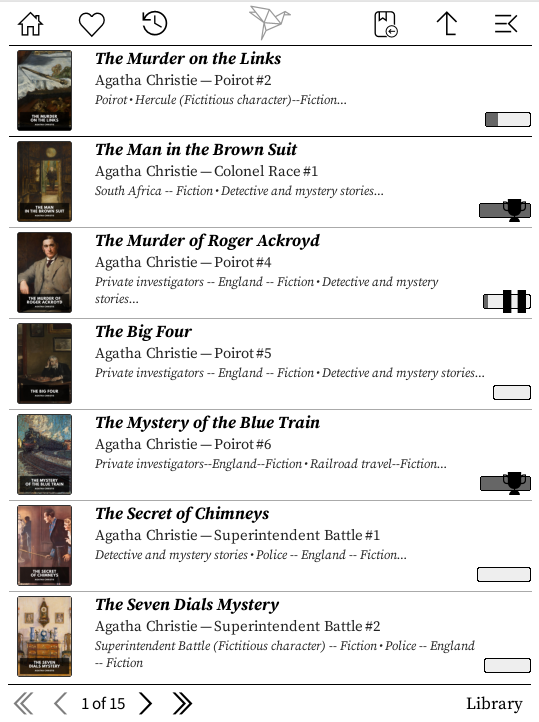</a> |

2-pt-limit-tags 
**Before:** An unlimited number of tags is displayed. **After:** The number of tags is limited (here: to 3).

### [🞂 2-pt-disable-folder-nbitems-overlay.lua](project-title/2-pt-disable-folder-nbitems-overlay.lua)

Removes the item count from folder overlays in Cover Grid view.

See Screenshots 

| Before | After |
|--------|-------|
|  | <a href="resources/gridview_folder_itemcount_patched.png">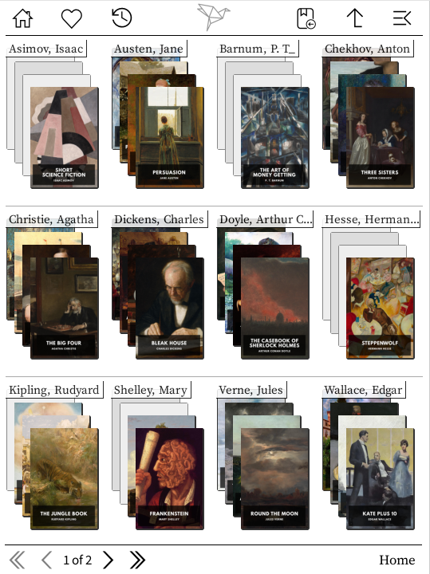</a> |

2-pt-disable-folder-nbitems-overlay 
**Before:** The number of subdirectories and files is displayed as an overlay at the bottom of the foldercover. **After:** Removed.

### [🞂 2-pt-disable-folder-image-search.lua](project-title/2-pt-disable-folder-image-search.lua)

Disables searching for folder cover images (cover.jpg, folder.png, etc.) and forces Project: Title to build folder thumbnails from book covers only.

By default, Project: Title first searches for dedicated folder cover images before falling back to building covers from book thumbnails. \
This patch skips the image file search entirely. \
If you do not intend to provide your own images, this will speed up turning pages in filebrowser (with lots of folders) slightly.

### [🞂 2-pt-modify-item-limits.lua](project-title/2-pt-modify-item-limits.lua)

Requires Project:Title v3.5

Customize the maximum number of items displayed per page.

See Screenshots 

| Before | After |
|--------|-------|
| <a href="resources/list_limit_vanilla.png">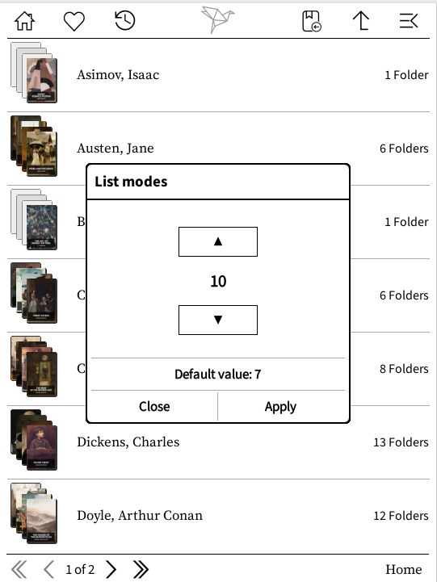</a> |  |
|  | <a href="resources/grid_limit_patched.png">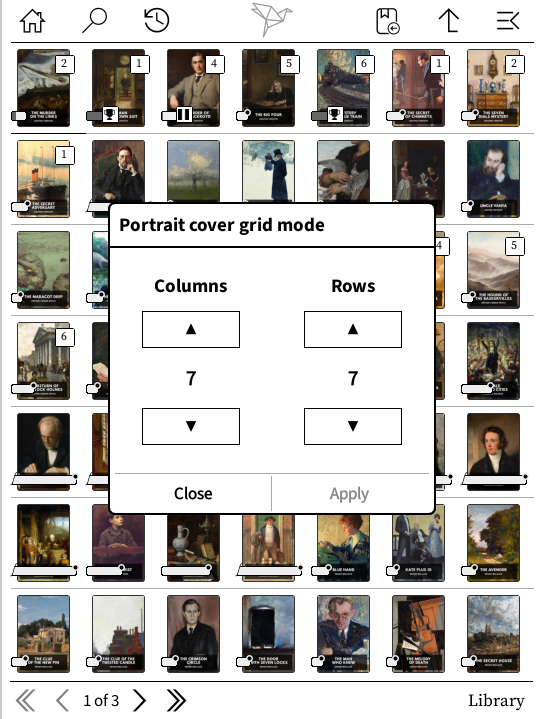</a> |

2-pt-modify-item-limits 
**Before:** The maximum amount of items on a page is limited. **After:** The limit is raised.

### [🞂 2-pt-modify-progressbar-max-width.lua](project-title/2-pt-modify-progressbar-max-width.lua)

Requires Project:Title v3.5

Increase the maximum progress bar width for longer books.
If your display settings allow for more space, you can de-/increase the maximum width of the progress bars.
Alternatively, you can change how many pages the progress bar represents by in/decreasing its resolution.

See Screenshots 

| Before | After |
|--------|-------|
| <a href="resources/progressbar_vanilla.png">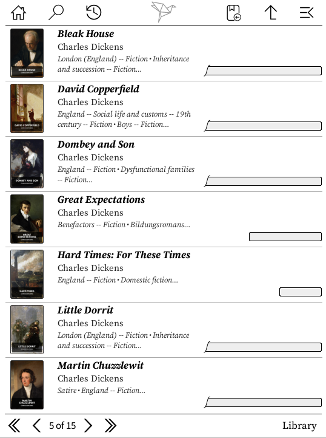</a> | <a href="resources/progressbar_patched.png">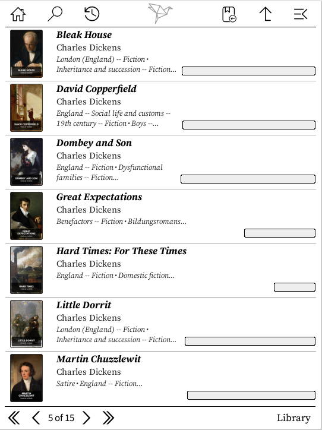</a> |

2-pt-modify-progressbar-max-width 
**Before:** The progressbar is limited to 235px/705 pages. **After:** The limit is raised.

### [🞂 2-pt-modify-series-format.lua](project-title/2-pt-modify-series-format.lua)

Requires Project:Title v3.5

Customize the format of the series in listview.
The file contains some suggestions, but you have complete freedom to define the format.

See Screenshots 

| Before | After |
|--------|-------|
|  <a href="resources/series_tags_vanilla.png">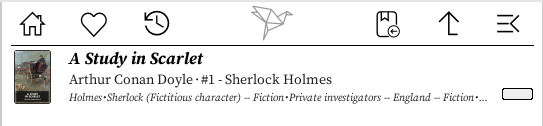</a> | <a href="resources/series_patched_reverse.png">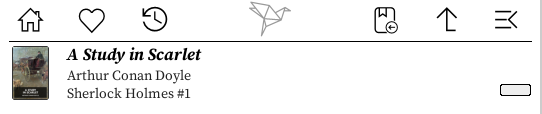</a>      |

2-pt-modify-series-format 
**Before:** The series is formatted as `#1 - Series`. **After:** A variety of formats to select from.

## License
[GNU AGPL v3](https://www.gnu.org/licenses/agpl-3.0.de.html)

## Author

Andreas Lösel

## Disclaimer

Using these patches may slow down your device or even break things.
Please use them at your own risk.

Feel free to contact me if you have questions or suggestions.

## Links

- [KOReader](https://github.com/koreader/koreader)
- [KOReader Userpatches Documentation](https://github.com/koreader/koreader/wiki/User-patches)
- [Project: Title](https://github.com/joshuacant/ProjectTitle)
- [WeatherLockscreen Plugin](https://github.com/loeffner/WeatherLockscreen) - Standalone weather lockscreen plugin
