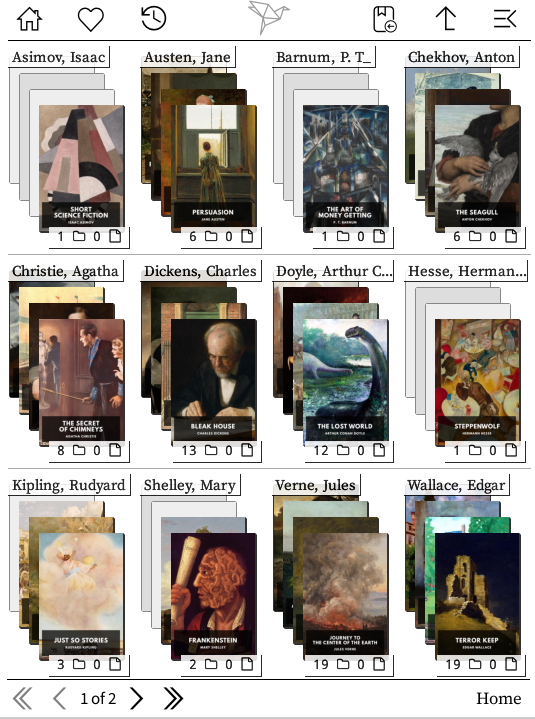
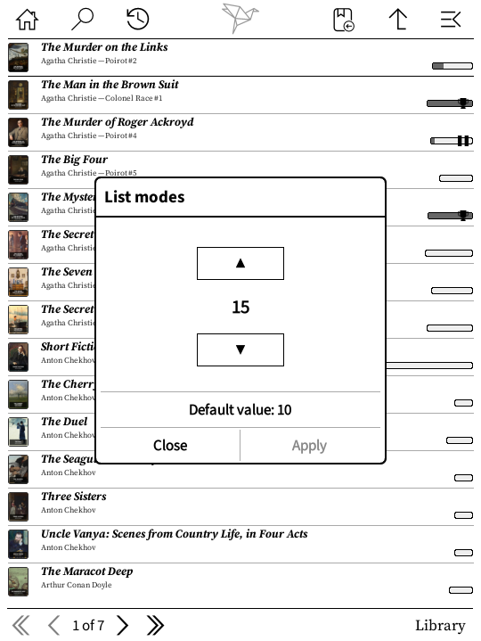
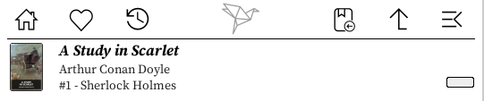
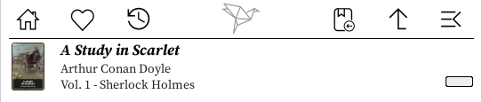
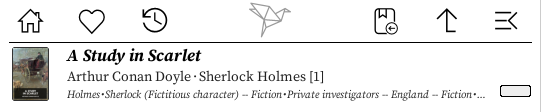

# KOReader Userpatches

This repository contains userpatches for customizing KOReader and its plugins.

The patches currently target:
- [Project: Title](https://github.com/joshuacant/ProjectTitle) plugin
- [Weather](https://github.com/roygbyte/weather.koplugin) plugin

## Installation

See the [KOReader documentation](https://koreader.rocks/user_guide/#L2-userpatches) for more information.

1. **Create a directory named patches under koreader directory on your device**

2. **Download and put the patch file with .lua extension in this patches directory**
   - You may want to modify the patch for your use-case.

3. **Restart KOReader:**
   - You can see the list and status of your user patches and enable/disable them in `Patch Management`.

## Project: Title Patches

### [🞂 2-pt-modify-font-sizes.lua](project-title/2-pt-modify-font-sizes.lua)
Requires Project:Title v3.5

Customize font sizes for titles, authors, and metadata in list view. \
I use this patch to disable the auto-sizing and make the strings look more uniform
by setting maximum and minimum font sizes to the same value.

| Before | After |
|--------|-------|
|  |  |
|  |  |

2-pt-modify-font-sizes 
**Before:** The directory strings are of varying font sizes. **After:** The directory strings are uniform. The limits for maximum/minimum font size are customizable.

### [🞂 2-pt-disable-progress-string.lua](project-title/2-pt-disable-progress-string.lua)

Removes the reading status text (New/Reading/Finished/On hold) from list view.
Attention: If you are using a different localization than english (or german), you will have to adapt the patch and add the strings in your language.

| Before | After |
|--------|-------|
|  |  |

2-pt-disable-progress-string 
**Before:** There is a string above the progress bar indicating the reading status. **After:** Removed.

### [🞂 2-pt-limit-tags.lua](project-title/2-pt-limit-tags.lua)
Requires Project:Title v3.5

Limit the number of tags displayed under books in list view.

| Before | After |
|--------|-------|
|  |  |

2-pt-limit-tags 
**Before:** An unlimited number of tags is displayed. **After:** The number of tags is limited (here: to 3).

### [🞂 2-pt-disable-folder-nbitems-overlay.lua](project-title/2-pt-disable-folder-nbitems-overlay.lua)

Removes the item count from folder overlays in Cover Grid view.

| Before | After |
|--------|-------|
|  |  |

2-pt-disable-folder-nbitems-overlay 
**Before:** The number of subdirectories and files is displayed as an overlay at the bottom of the foldercover. **After:** Removed.

### [🞂 2-pt-modify-item-limits.lua](project-title/2-pt-modify-item-limits.lua)
Requires Project:Title v3.5

Customize the maximum number of items displayed per page.

| Before | After |
|--------|-------|
|  |  |
|  |  |

2-pt-modify-item-limits 
**Before:** The maximum amount of items on a page is limited. **After:** The limit is raised.

### [🞂 2-pt-modify-progressbar-max-width.lua](project-title/2-pt-modify-progressbar-max-width.lua)
Requires Project:Title v3.5

Increase the maximum progress bar width for longer books.
If your display settings allow for more space, you can de-/increase the maximum width of the progress bars.

| Before | After |
|--------|-------|
|  |  |

2-pt-modify-progressbar-max-width 
**Before:** The progressbar is limited to 235px/705 pages. **After:** The limit is raised.

### [🞂 2-pt-modify-series-format.lua](project-title/2-pt-modify-series-format.lua)
Requires Project:Title v3.5

Customize the format of the series in listview.
The file contains some suggestions, but you have complete freedom to define the format.

| Before | After |
|--------|-------|
|   |       |

2-pt-modify-series-format 
**Before:** The series is formatted as `#1 - Series`. **After:** A variety of formats to select from.

## Weather Patches

### WIP: [🞂 2-weather-lockscreen.lua](weather/2-weather-lockscreen.lua)
Requires the [Weather](https://github.com/roygbyte/weather.koplugin) plugin.

Display weather conditions as a lockscreen/screensaver with weather icons.
Can be selected in Settings > Screen > Sleep screen > Wallpaper

**Features:**
- Shows weather icon based on current conditions
- SHows weather forecast for same day and the next day

**Setup Requirements:**
- Weather plugin must be installed and configured (postal code, API key)
- Weather icon files (sun.svg & moon.svg) must be placed in `koreader/icons/` on your device
- Enable patch in Patch Management, then select "Weather" in Sleep screen > Wallpaper menu
- See [weather/README.md](weather/README.md)

## License
[GNU AGPL v3](https://www.gnu.org/licenses/agpl-3.0.de.html)

## Author

Andreas Lösel

## Disclaimer

Using these patches may slow down your device or even break things.
Please use them at your own risk.

Feel free to contact me if you have questions or suggestions.

## Links

- [KOReader](https://github.com/koreader/koreader)
- [KOReader Userpatches Documentation](https://github.com/koreader/koreader/wiki/User-patches)
- [Project: Title](https://github.com/joshuacant/ProjectTitle)

### More User Patches
- [joshuacant/KOReader.patches](https://github.com/joshuacant/KOReader.patches)
- [sebdelsol/KOReader.patches](https://github.com/sebdelsol/KOReader.patches)
