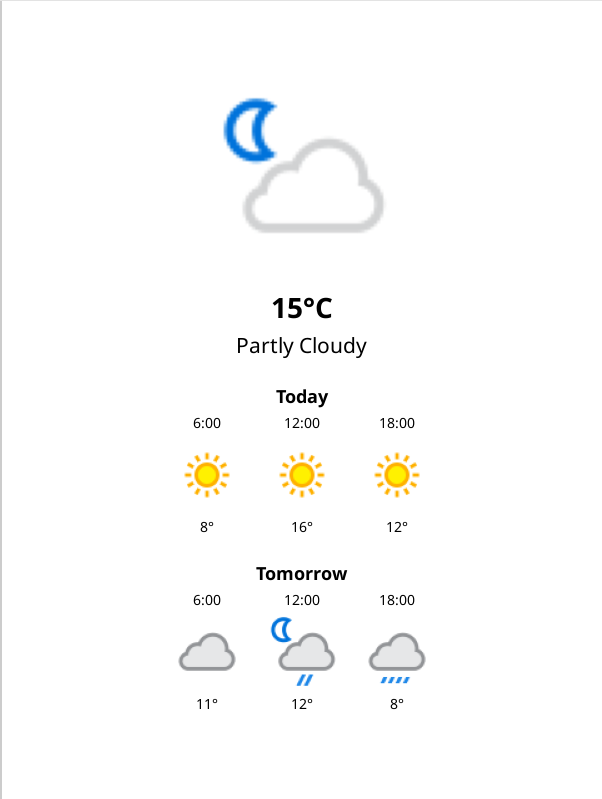

## Weather patches

There are a few [minor issues](https://github.com/roygbyte/weather.koplugin/pull/1) with the weather plugin, but this patch should still work.

### [🞂 2-weather-lockscreen.lua](2-weather-lockscreen.lua)
Requires the [Weather](https://github.com/roygbyte/weather.koplugin) plugin.

Display weather conditions as a lockscreen/screensaver with weather icons.
Can be selected in Settings > Screen > Sleep screen > Wallpaper

**Features:**
- Shows weather icon based on current conditions
- Shows weather forecast for same day and the next day

### Installation

See the [KOReader documentation](https://koreader.rocks/user_guide/#L2-userpatches) for more information.

0. **Install the [Weather](https://github.com/roygbyte/weather.koplugin) plugin**

1. **Create a directory named patches under koreader directory on your device**

2. **Download and put the patch file with .lua extension in this patches directory**
   - You may want to modify the patch for your use-case.

3. **Put the [icons](icons) into the koreader/icons directory. **
   - If it does not exist, create one.

4. **Restart KOReader:**
   - You can see the list and status of your user patches and enable/disable them in `Patch Management`.
   - Navigate to Settings > Screen > Sleep screen > Wallpaper and select `Show weather on sleep screen`.

## License
[GNU AGPL v3](https://www.gnu.org/licenses/agpl-3.0.de.html)

## Author

Andreas Lösel

## Disclaimer

Using these patches may slow down your device or even break things.
Please use them at your own risk.

Feel free to contact me if you have questions or suggestions.
